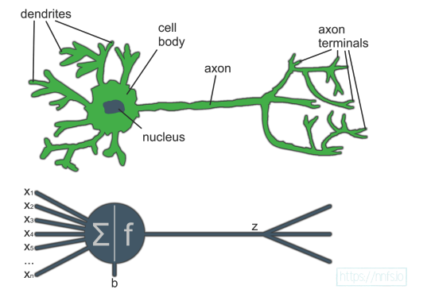
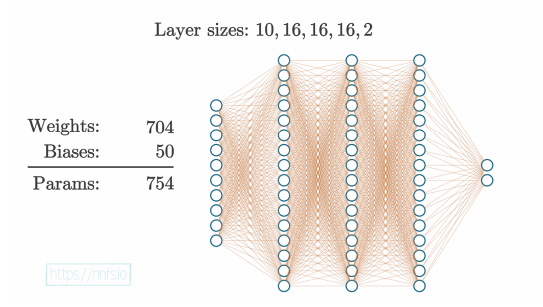
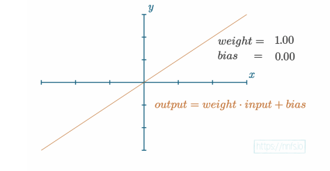
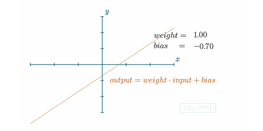
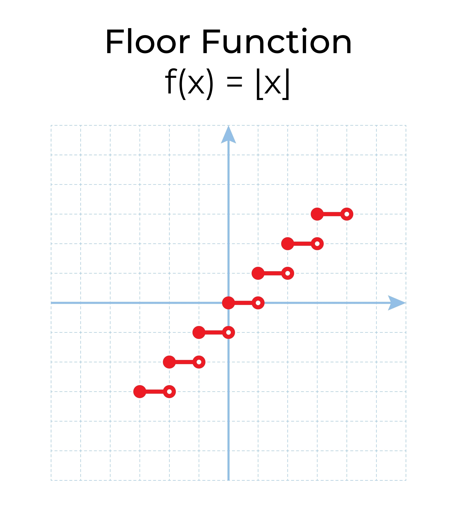
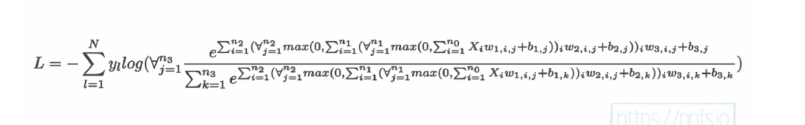

The nature of neuron network is a bunch of mathematical equation and we turn them into programming. The idea to understand that you need to look at the high-level impresssion and break them into painfully simple explanations, which will cover forward and backward passes involved in training neural network.

Comparing a biological neuron to an artificial neuron.

1. Layer Sizes: 10, 16, 16, 16, 2
This defines the "shape" of the network. Each number represents the number of neurons in a specific layer:

10 (Input Layer): The network accepts 10 unique features or data points.

16, 16, 16 (Hidden Layers): There are three "hidden" layers in the middle, each containing 16 neurons. These layers perform the complex pattern recognition.

2 (Output Layer): The final layer has 2 neurons, typically representing a binary classification (e.g., "Yes" or "No," "Cat" or "Dog").

2. Weights: 704
Weights represent the strength of the connections between neurons. In a "fully connected" network like this, every neuron in one layer connects to every neuron in the next. The math works as follows:Layer 1 to 2: $10 \times 16 = 160$ weightsLayer 2 to 3: $16 \times 16 = 256$ weightsLayer 3 to 4: $16 \times 16 = 256$ weightsLayer 4 to 5: $16 \times 2 = 32$ weightsTotal: $160 + 256 + 256 + 32 = \mathbf{704}$

3. Biases: 50
The primary role of a bias is to provide a neuron with the flexibility to "fire" (become active) even when its inputs are zero, or to remain inactive even when inputs are high.Weight ($m$): Determines the slope or strength of the connection between neurons.Bias ($b$): Determines the threshold or baseline. It represents how easy or hard it is for that neuron to send a signal to the next layer.

Every neuron in the hidden and output layers has one bias (an offset value). The input layer does not have biases because it only passes data through.Calculations: $16 + 16 + 16 + 2 = \mathbf{50}$

// Simplified logic for a single neuron's output
double[] inputs = {1.0, 2.0, 3.0};
double[] weights = {0.2, 0.8, -0.5};
double bias = 2.0; // The bias parameter

double sum = 0;
for (int i = 0; i < inputs.length; i++) {
    sum += inputs[i] * weights[i];
}

// Applying the bias
double result = sum + bias; 

// Pass to activation function (e.g., ReLU)
double finalOutput = Math.max(0, result);

Bias and weight are both tunable parameters , not just like a simple y=mx+b. Can visualize with:

As we increase the bias, the function output overall shifts upward. If we decrease the bias, then
the overall function output will move downward. For example, with a negative bias:

## Step function

Step function is simple form of an activation function. It acts as a mathematical gatekeeper that decides whether a neuron should "fire" or not based on the input it receives -> calculation from the result of the output of the weighed linear combination  of inputs  (often written as $  \mathbf{w} \cdot \mathbf{x} + b  $, where $  b  $ is the bias/threshold).

The Mathematical FormulaIn a notebook implementation, the logic looks like this:$$f(x) = \begin{cases} 1 & \text{if } x \geq 0 \\ 0 & \text{if } x < 0 \end{cases}$$Where $x$ is the result of your calculation: $(\sum \text{weights} \cdot \text{inputs}) + \text{bias}$.

## Number of output neuron based on input and problem type:
| Problem Type          | Number of Classes | Output Neurons | Common Activation |
|-----------------------|-------------------|----------------|-------------------|
| Binary                | 2                 | 1              | Sigmoid           |
| Binary (Alternative)  | 2                 | 2              | Softmax           |
| Multi-Class           | N                 | N              | Softmax           |

Binary (1 output neuron + Sigmoid)
Most common and memory-efficient approach for binary classification.
Output is a single probability ∈ [0,1] after sigmoid.
Loss: Usually Binary Cross-Entropy (BCE / BCEWithLogits).
Threshold: Typically 0.5 to decide class 0 vs. class 1.
Advantage: Fewer parameters, simpler.

Binary (2 output neurons + Softmax)
Less common today but still used (especially in older literature or when you want symmetry with multi-class code).
Two logits → softmax → two probabilities that sum to 1.
Loss: Categorical Cross-Entropy (same as multi-class).
You take argmax or look at probability of positive class.
Disadvantage: Slightly redundant (one probability is always 1 – the other), uses more parameters.

Multi-Class (N classes → N neurons + Softmax)
Standard for problems with >2 mutually exclusive classes (e.g., ImageNet: 1000 classes → 1000 output neurons).
Softmax ensures probabilities sum to 1.
Loss: Categorical Cross-Entropy.
One-hot encoded labels.
Edge case: When N is very large (e.g., 100k+ vocabulary in NLP), people sometimes use hierarchical softmax, sampled softmax, or output approximations — but the table shows the classic case.

## Neural forward pass computing

Hãy tưởng tượng mạng nơ-ron như một nhà máy sản xuất dự đoán:

Nguyên liệu đầu vào → X (một bảng số, mỗi hàng là 1 mẫu dữ liệu)
Nhà máy có 4 tầng (3 tầng ẩn + 1 tầng ra)
Mỗi tầng có công nhân (neuron), mỗi công nhân có công thức tính giống nhau.

Bước nhỏ 1: Tầng 1 (hidden layer 1)
Công thức đơn giản nhất của 1 neuron:
output = (input × weight) + bias
→ rồi áp dụng ReLU: nếu output < 0 thì = 0, còn lại giữ nguyên
Trong code: np.maximum(0, np.dot(X_r, w1.T) + b1)

X_r: dữ liệu đầu vào (batch nhiều mẫu)
w1.T: ma trận trọng số của tầng 1 (đã transpose để nhân ma trận đúng chiều)
np.dot(…): nhân ma trận → tính tổng có trọng số cho tất cả neuron tầng 1
+ b1: cộng bias cho từng neuron
np.maximum(0, …): ReLU — loại bỏ số âm (như neuron “không kích hoạt”)

Kết quả: A1 = output của tầng 1 (đã ReLU)
Bước nhỏ 2: Tầng 2 (hidden layer 2)
Lấy output của tầng 1 làm input cho tầng 2:
A2 = ReLU( A1 × w2 + b2 )
Trong code: np.maximum(0, np.dot( [tầng 1], w2.T) + b2 )
Bước nhỏ 3: Tầng 3 (hidden layer 3)
Tương tự:
A3 = ReLU( A2 × w3 + b3 )
Bước nhỏ 4: Tầng cuối (output layer) → logits
Không dùng ReLU nữa, chỉ tính tuyến tính:
logits = A3 × w_out + b_out
Đây là điểm số thô (raw scores) cho từng lớp (ví dụ: 10 lớp → mỗi mẫu có 10 số)
Bước nhỏ 5: Biến logits thành xác suất (softmax)
Công thức softmax cho 1 mẫu:
prob_i = exp(score_i) / (exp(score_1) + exp(score_2) + … + exp(score_n))
Nhưng để tránh tràn số (overflow), người ta trừ đi số lớn nhất trước:
exp(score_i - max_score) / sum(exp(score_j - max_score))
Trong code: phần np.exp( … - np.maximum( … , axis=1, keepdims=True) )
Bước nhỏ 6: Tính loss cho 1 mẫu
Loss = - log( xác suất của lớp đúng )
Ví dụ: lớp đúng là class 3 → -log(prob_3)
Trong code: y * np.log( probs ) → y là one-hot (chỉ có 1 ở vị trí lớp đúng, còn lại 0) → chỉ giữ lại log của lớp đúng
Bước nhỏ 7: Loss trung bình cả batch
loss = - mean( correct_logprobs )
→ càng gần 0 càng tốt (mạng đoán đúng gần như chắc chắn)

# Phân tích Forward Pass + Loss của Mạng Nơ-ron (từ Neural Networks from Scratch)

## 1. Thông số đầu vào (Inputs)
* **Input X**: 1 mẫu với 3 đặc trưng (features) → $X = [0.5, -1.0, 2.0]$
* **Nhãn thật y (One-hot)**: Lớp 1 là lớp đúng → $y = [0, 1, 0]$
* **Cấu trúc mạng**: 3 (Input) → 2 (H1) → 2 (H2) → 2 (H3) → 3 (Output)

---

## 2. Các tham số mạng (Weights & Biases)

### Hidden Layer 1 (3 → 2)
- **Weights ($w_1$):** `[[0.4, 0.6], [-0.2, 0.3], [0.5, -0.1]]`
- **Bias ($b_1$):** `[0.1, -0.1]`

### Hidden Layer 2 (2 → 2)
- **Weights ($w_2$):** `[[0.3, -0.4], [0.5, 0.2]]`
- **Bias ($b_2$):** `[0.0, 0.0]`

### Hidden Layer 3 (2 → 2)
- **Weights ($w_3$):** `[[-0.1, 0.4], [0.2, -0.3]]`
- **Bias ($b_3$):** `[0.0, 0.0]`

### Output Layer (2 → 3)
- **Weights ($w_{out}$):** `[[0.1, -0.2, 0.5], [-0.3, 0.4, -0.1]]`
- **Bias ($b_{out}$):** `[0.0, 0.0, 0.0]`

---

## 3. Các bước tính toán (Calculation Steps)

# BÀI TOÁN: LAN TRUYỀN TIẾN (FORWARD PASS) VÀ TÍNH LOSS

## 1. Thông số đầu vào (Inputs)
* **Input X**: 1 mẫu với 3 đặc trưng (features) → $X = [0.5, -1.0, 2.0]$
* **Nhãn thật y (One-hot)**: Lớp 1 là lớp đúng → $y = [0, 1, 0]$
* **Cấu trúc mạng**: 3 (Input) → 2 (H1) → 2 (H2) → 2 (H3) → 3 (Output)

---

## 2. Các tham số mạng (Weights & Biases)

### Hidden Layer 1 (3 → 2)
- **Weights ($w_1$):** `[[0.4, 0.6], [-0.2, 0.3], [0.5, -0.1]]`
- **Bias ($b_1$):** `[0.1, -0.1]`

### Hidden Layer 2 (2 → 2)
- **Weights ($w_2$):** `[[0.3, -0.4], [0.5, 0.2]]`
- **Bias ($b_2$):** `[0.0, 0.0]`

### Hidden Layer 3 (2 → 2)
- **Weights ($w_3$):** `[[-0.1, 0.4], [0.2, -0.3]]`
- **Bias ($b_3$):** `[0.0, 0.0]`

### Output Layer (2 → 3)
- **Weights ($w_{out}$):** `[[0.1, -0.2, 0.5], [-0.3, 0.4, -0.1]]`
- **Bias ($b_{out}$):** `[0.0, 0.0, 0.0]`

---

## 3. Các bước tính toán (Calculation Steps)

### Bước 1: Hidden Layer 1 + ReLU
Tính $z_1 = X \cdot w_1 + b_1$:
* **Neuron 1**: $(0.5 \times 0.4) + (-1.0 \times -0.2) + (2.0 \times 0.5) + 0.1 = 0.2 + 0.2 + 1.0 + 0.1 = \mathbf{1.5}$
* **Neuron 2**: $(0.5 \times 0.6) + (-1.0 \times 0.3) + (2.0 \times -0.1) - 0.1 = 0.3 - 0.3 - 0.2 - 0.1 = \mathbf{-0.3}$
* **Sau ReLU**: $A_1 = [\max(0, 1.5), \max(0, -0.3)] = \mathbf{[1.5, 0.0]}$

### Bước 2: Hidden Layer 2 + ReLU
Tính $z_2 = A_1 \cdot w_2 + b_2$:
* **Neuron 1**: $(1.5 \times 0.3) + (0 \times 0.5) + 0 = \mathbf{0.45}$
* **Neuron 2**: $(1.5 \times -0.4) + (0 \times 0.2) + 0 = \mathbf{-0.6}$
* **Sau ReLU**: $A_2 = [\max(0, 0.45), \max(0, -0.6)] = \mathbf{[0.45, 0.0]}$

### Bước 3: Hidden Layer 3 + ReLU
Tính $z_3 = A_2 \cdot w_3 + b_3$:
* **Neuron 1**: $(0.45 \times -0.1) + (0 \times 0.2) + 0 = \mathbf{-0.045}$
* **Neuron 2**: $(0.45 \times 0.4) + (0 \times -0.3) + 0 = \mathbf{0.18}$
* **Sau ReLU**: $A_3 = [\max(0, -0.045), \max(0, 0.18)] = \mathbf{[0.0, 0.18]}$

### Bước 4: Output Layer (Logits)
Tính $Logits = A_3 \cdot w_{out} + b_{out}$:
* **Lớp 0**: $(0.0 \times 0.1) + (0.18 \times -0.3) = \mathbf{-0.054}$
* **Lớp 1**: $(0.0 \times -0.2) + (0.18 \times 0.4) = \mathbf{0.072}$
* **Lớp 2**: $(0.0 \times 0.5) + (0.18 \times -0.1) = \mathbf{-0.018}$
* **Kết quả**: $Logits = [-0.054, 0.072, -0.018]$

### Bước 5: Softmax (Xác suất)
* $exp(-0.054 - 0.072) \approx 0.882$
* $exp(0.072 - 0.072) = 1.000$
* $exp(-0.018 - 0.072) \approx 0.914$
* **Tổng $exp$**: $0.882 + 1.000 + 0.914 \approx 2.796$
* **Xác suất (Probs)**: $[0.315, 0.358, 0.327]$

---

## 4. Kết quả cuối cùng
* **Dự đoán**: Mạng chọn Lớp 1 (xác suất cao nhất: **35.8%**)
* **Loss (Categorical Cross-Entropy)**:
  $$L = -\ln(0.358) \approx \mathbf{1.028}$$

----
# Generalization data
which means learning to fit the data instead of memorizing it. The
idea is that we “train” (slowly adjusting weights and biases) a neural network on many examples
of data. We then take out-of-sample data that the neural network has never been presented with
and hope it can accurately predict on these data too.