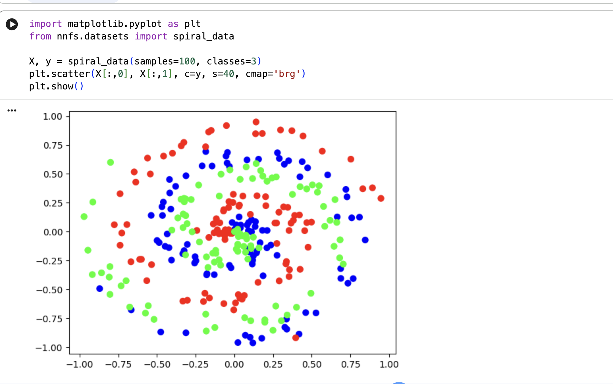

nnfs.init(). Do two things:
1. Sets a fixed random seed globally: 
Pythonnp.random.seed(0)→ This makes allnp.random.randn(), np.random.rand(), etc. produce the exact same numbers every time you run the code (as long as you don't change the seed).
2. Sets the default NumPy float dtype to np.float32:
Pythonnnfs.set_defaults(dtype=np.float32)→ All newly created NumPy arrays will use 32-bit floats by default instead of 64-bit (float64).
→ This mimics what most deep learning frameworks (PyTorch, TensorFlow) do by default and saves memory (especially important when you later deal with large weight matrices or batches).

# Giới thiệu vấn đề linear activation
Tại sao linear activation → toàn bộ mạng là linear (composition of linear functions is linear).
Ví dụ minh họa: Dù 100 layer, nếu mỗi layer là y = Wx + b → output cuối vẫn là một ma trận W lớn nhân input + bias → không thể học non-linear data.
Đây là phần bạn đang đọc (trang ~77).

The Step Activation Function
Hàm bước (binary step / Heaviside): 0 nếu x < 0, 1 nếu x ≥ 0.
Ưu: Đơn giản, giống neuron sinh học.
Nhược: Không differentiable → không dùng backprop được.

The Linear Activation Function
f(x) = x (hoặc scale).
Vấn đề: Không thêm non-linearity → toàn mạng vẫn linear.

The Sigmoid Activation Function
σ(x) = 1 / (1 + e^(-x)).
Ưu: Output (0,1) → giống probability, differentiable.
Nhược: Vanishing gradient (gradient gần 0 khi |x| lớn), outputs không zero-centered → cập nhật gradient zig-zag.

The Rectified Linear Unit (ReLU)
f(x) = max(0, x).
Đây là trọng tâm lớn của chương: Tại sao ReLU trở thành default (fast, no vanishing gradient ở positive side, sparse activation).
Thảo luận vấn đề "dying ReLU" / dead neurons (neuron luôn output 0 nếu bias + weights làm nó luôn âm).
Cách khắc phục: Leaky ReLU, Parametric ReLU (không implement sâu ở chương này).

The Softmax Activation Function
Dùng cho output layer trong multi-class classification.
Công thức: softmax(x_i) = e^{x_i} / Σ e^{x_j}.
Numerical stability: Trừ max trước khi exp để tránh overflow.
Kết hợp với categorical cross-entropy loss (sẽ dùng ở chương sau).

Implementation trong Python (code chính)
Class Activation_ReLU
Class Activation_Softmax
Forward pass với các ví dụ (spiral data, etc.).
Xử lý edge cases: dead neurons, exp overflow/underflow.