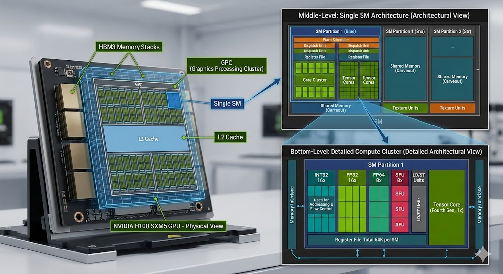
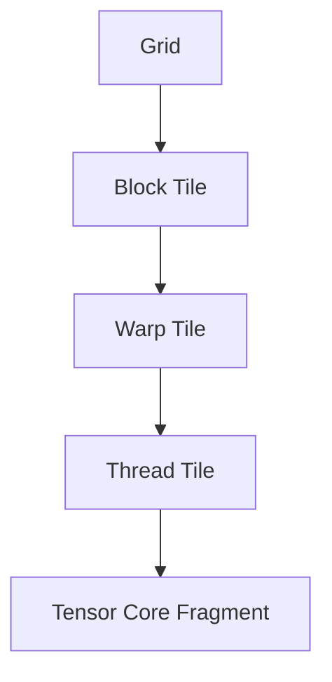

# Rebuilding cuBLAS: A Stepwise Study of CUDA GEMM Optimization

## Abstract

This repository studies how a general matrix multiplication (GEMM) kernel naturally evolves from a correct but conceptually naive CUDA implementation into a hardware-aware design that approaches the structure of modern high-performance GEMM libraries. The project is structured as a sequence of kernels, where each iteration introduces a single major optimization targeting the dominant performance bottleneck.

The progression covers memory coalescing, shared-memory tiling, register tiling, vectorization, warp tiling, Tensor Core WMMA, shared-memory-staged WMMA, and software pipelining with a producer-consumer structure.

Disclaimer: The primary academic value of this work is not solely in yielding a fast kernel, but in making visible the relationships between algorithmic decomposition, GPU memory hierarchy, instruction issue behavior, arithmetic intensity, and Tensor Core utilization. It serves as both an optimization case study and a conceptual bridge from classic CUDA core programming to modern Tensor Core pipeline designs.

## Performance Tracking

The following table documents the raw GFLOP/s and execution times of the kernels benchmarking a matrix of $2048 \times 2048 \times 2048$.

| Kernel                             | Time (ms) | Performance (GFLOP/s) | Max Absolute Error | Status  |
| :--------------------------------- | :-------- | :-------------------- | :----------------- | :------ |
| **01. Naive SGEMM**                | 36.896    | 465.63                | 1.83e-04           | ✅ Pass |
| **02. Shared Memory Tiling**       | 20.195    | 850.68                | 1.83e-04           | ✅ Pass |
| **03. Register Tiling (1D)**       | 16.164    | 1062.82               | 1.83e-04           | ✅ Pass |
| **04. Register Tiling (2D)**       | 12.473    | 1377.36               | 1.83e-04           | ✅ Pass |
| **05. Vectorized Register Tiling** | 5.199     | 3304.42               | 1.83e-04           | ✅ Pass |
| **06. Warp Tiling**                | 13.326    | 1289.19               | 1.83e-04           | ✅ Pass |
| **07. Tensor Cores (WMMA)**        | 7.780     | 2208.25               | 0.00e+00           | ✅ Pass |
| **08. Tensor Cores SMEM WMMA**     | 7.052     | 2436.32               | 0.00e+00           | ✅ Pass |
| **09. Async Pipeline WMMA**        | 6.340     | 2709.72               | 0.00e+00           | ✅ Pass |

## 1. Problem Statement

The core computation studied in this repository is GEMM:

`C = alpha * A * B + beta * C`

Following standard conventions, the matrices are defined as:

- `A ∈ ℝ^(M × K)`
- `B ∈ ℝ^(K × N)`
- `C ∈ ℝ^(M × N)`

The central problem addressed is that a naive GPU implementation of GEMM fails to exploit the memory and execution hierarchies of NVIDIA GPUs. Despite GEMM's extremely high theoretical parallelism, a simple kernel typically suffers from excessive global-memory traffic, poor data reuse, low arithmetic intensity, high load/store instruction overhead, register pressure, insufficient overlap between memory and compute, and underutilization of Tensor Cores. This repository investigates how these inefficiencies can be systematically eliminated through kernel restructuring.

## 2. Research Objective

This project aims to answer the following question:

> **How does a CUDA GEMM kernel need to be transformed, stage by stage, to progress from a correctness-oriented baseline to a structured, high-performance GPU matrix multiplication?**

Specifically, the project aims to:

1. Identify the dominant bottleneck at each optimization stage.
2. Introduce one isolated structural optimization to mitigate that bottleneck.
3. Explain the resulting dataflow and execution model.
4. Analyze the trade-offs introduced by each architectural change.
5. Construct a logical progression from scalar CUDA core execution to asynchronous Tensor Core pipelines.

## 3. Why GEMM Matters

GEMM is a foundational kernel in scientific computing, numerical linear algebra, and deep learning. Many complex higher-level operations ultimately reduce to matrix multiplication. Consequently, GEMM is not merely a benchmark, but a central primitive dictating end-to-end performance in compute-bound workloads.

For GPU performance engineering, GEMM is an ideal case study because it exposes the full interaction between thread hierarchy, warp scheduling, global and shared memory bandwidth, register reuse, instruction issue throughput, and specialized hardware units like Tensor Cores.

## 4. Conceptual Dataflow

At a high level, optimized GEMM kernels progressively transform the dataflow from a direct global-memory computation model into a staged, hierarchical pipeline.

The optimization sequence in this repository systematically improves each data transition:

- Global memory to shared memory
- Shared memory to registers
- Registers to accumulators
- Accumulators to the final output validation

## 5. Execution Hierarchy

A core principle underlying this project is that an optimized GEMM must align perfectly with the GPU's execution hierarchy.

Early kernels operate primarily at the block and thread levels. Subsequent kernels introduce warp-aware tiling and Tensor Core mapping, progressively tuning the work granularity to match the actual hardware scheduling and execution models.

## 6. Optimization Roadmap

| Version | File                                       | Core Optimization              | Main Bottleneck Targeted                           |
| :------ | :----------------------------------------- | :----------------------------- | :------------------------------------------------- |
| **01**  | `01. Build Naive SGEMM.cu`                 | Baseline CUDA SGEMM            | Establish correctness and baseline mapping         |
| **02**  | `02. Shared Memory Tiling.cu`              | Shared-memory tiling           | Repeated global-memory accesses                    |
| **03**  | `03. Register Tiling - 1 side.cu`          | 1D register tiling             | Low arithmetic intensity                           |
| **04**  | `04. Register Tiling - 2 side.cu`          | 2D register tiling             | Excessive shared-memory traffic per output         |
| **05**  | `05. Vectorized Register Tiling.cu`        | Vectorized loads/stores        | Load/store instruction pressure                    |
| **06**  | `06. Warp Tiling.cu`                       | Warp tiling                    | Scheduler alignment, locality, register pressure   |
| **07**  | `07. Tensor Cores (Async TMA + WGMMA).cu`  | WMMA Tensor Core baseline      | Transition compute from scalar FMA to Tensor Cores |
| **08**  | `08. Tensor Cores - Shared Memory WMMA.cu` | Shared-memory staged WMMA      | Tensor Core operand reuse and feed efficiency      |
| **09**  | `09. Async Producer–Consumer Pipeline.cu`  | Software pipelining & epilogue | Pipeline bubbles and load/compute serialization    |

## 7. Deep Explanation of Each Stage

### 7.1 Version 1: Naive SGEMM

The baseline kernel maps output elements directly to threads. Each thread computes one output by traversing the entire reduction dimension.

- **Demonstrates:** The basic GEMM structure and standard grid-to-matrix mapping.
- **Bottlenecks:** Every thread redundantly fetches from global memory, resulting in negligible arithmetic intensity and massive memory bandwidth bottlenecks.

### 7.2 Version 2: Shared-Memory Tiling

Introduces block-cooperative loading of `A` and `B` tiles into shared memory.

- **Improvements:** A single tile loaded from global memory is reused across the block, drastically reducing global bandwidth requirements.
- **New Bottleneck:** Shared-memory traffic scales up; each output still demands repeated shared-memory reads.

### 7.3 Versions 3 & 4: Register Tiling

Shifts data reuse deeper into the hierarchy by assigning multiple output elements to each thread (1D, then 2D).

- **Improvements:** Operands loaded into registers are reused across multiple FMA instructions, increasing arithmetic intensity and reducing shared-memory reads.
- **Trade-offs:** Higher output per thread increases register pressure, potentially limiting occupancy if untuned.

### 7.4 Version 5: Vectorized Register Tiling

Targets instruction-level inefficiencies in the memory path.

- **Improvements:** Vector instructions (e.g., `float4`) fetch multiple elements per issued instruction. This lowers the instruction pressure in the load/store units and improves frontend efficiency independently of memory transaction coalescing.

### 7.5 Version 6: Warp Tiling

Introduces warp-level ownership of output sub-tiles, bridging the gap between block-wide sharing and thread-local computation.

- **Improvements:** Matches the hardware’s true execution unit (the warp), ensuring exceptional scheduler alignment, spatial locality, and a reduction in redundant register usage. This serves as the critical conceptual bridge toward Tensor Cores.

### 7.6 Version 7: Tensor Core WMMA Baseline

Replaces scalar FMA instructions on CUDA cores with warp-wide matrix multiply-accumulate operations on Tensor Cores.

- **Improvements:** Unlocks specialized hardware for dense math. The optimization focus officially shifts from organizing scalar arithmetic to efficiently feeding matrix hardware geometry.

### 7.7 Version 8: Shared-Memory Staged WMMA

Refines the Tensor Core dataflow by staging operands through shared memory rather than relying solely on global memory fragment loads.

- **Improvements:** Restores operand reuse across warps, vastly improving locality and bringing the dataflow closer to production CUDA capabilities.

### 7.8 Version 9: Producer-Consumer Pipeline and Epilogue Staging

Implements software pipelining and structured shared-memory epilogues.

- **Improvements:** Overlaps memory fetches (producer) with computation (consumer) to hide latency and eliminate Tensor Core stalls. Staging the epilogue in shared memory allows the output matrix to be efficiently coalesced prior to the final global-memory write.

## 8. Experimental Methodology

To evaluate the progress of kernel optimization systematically, the project employs the following benchmarking protocol across implementations:

1. **Fixed Problem Dimensions:** Matrices are evaluated at standardized sizes (e.g., M=N=K=4096) to accurately measure caching effects.
2. **Warmup & Repeated Execution:** Cold-start anomalies are masked via warmup iterations followed by averaged timing runs.
3. **Reference Validation:** Maximum absolute error is calculated against a trusted CPU/GPU reference (e.g., cuBLAS) to guarantee mathematical correctness.
4. **Performance Profiling:** Throughput is reported in GFLOP/s, complemented by key Nsight Compute metrics identifying stall reasons (e.g., Memory Dependency, Execution Dependency) at each stage.

## 9. Conclusion

This project serves as an architectural study demonstrating that high-performance GEMM is not achieved through a single algorithmic trick, but via a sequence of deliberate, hardware-aligned transformations. By exposing the bottlenecks from naive memory accesses down to asynchronous Tensor Core pipelines, this repository provides clear visibility into the trade-offs that dictate modern high-performance GPU programming.

## 10. Inspiration and Acknowledgement

This work draws inspiration from performance engineering worklogs that treat GEMM optimization as a sequence of isolated structural improvements rather than as a single opaque final kernel. In particular, Hamza Elshafie's H100 GEMM optimization study helped shape the methodological framing of this repository: analyze one optimization at a time, identify the bottleneck it targets, and explain the hardware consequences of each change.
